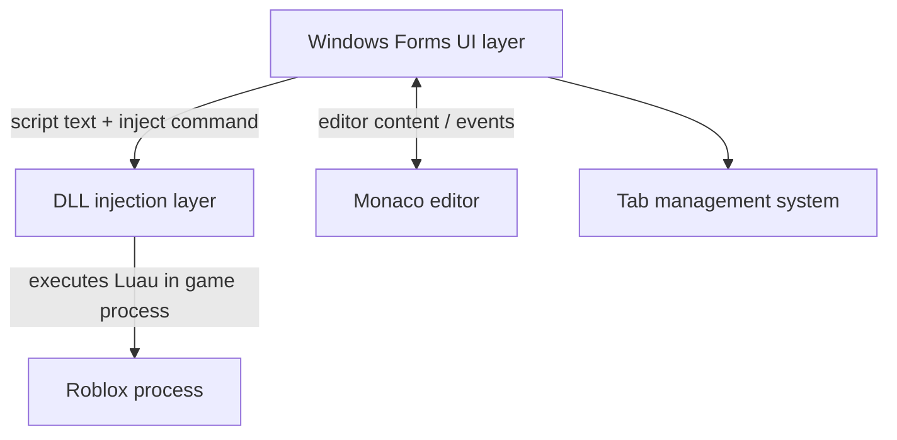

LInjector is built from four cooperating layers: a Windows Forms shell that renders the application window and handles user input, a Monaco editor instance that provides a full IDE experience inside that shell, a DLL injection layer that bridges the C# process to the Roblox game process, and a tab management system that keeps memory use bounded regardless of how many scripts you have open. Understanding where each layer lives and how control flows between them makes it much easier to modify any one of them without breaking the others.

## High-level overview

The user interacts entirely with the Windows Forms layer. When you click **Inject**, the UI reads the current script text from Monaco, passes it to the DLL injection layer, and that layer performs the actual process attachment and Luau execution. The tab system sits alongside all of this, keeping each open script buffered in memory without leaking resources.

## Key components

<CardGroup cols={2}>
  <Card title="Windows Forms UI layer" icon="window">
    The application window, all controls, event handlers, and the overall layout. Built with .NET Framework 4.8 WinForms.
  </Card>
  <Card title="Monaco editor" icon="code">
    A WebView/browser control hosting the Monaco JS runtime, with Luau syntax highlighting provided by the Krnl/Depso integration.
  </Card>
  <Card title="DLL injection layer" icon="plug">
    A thin C# bridge that calls into an external DLL to attach to the Roblox process and execute Luau bytecode.
  </Card>
  <Card title="Tab management system" icon="layout-panel-top">
    An optimized buffer system that keeps 40+ script tabs open simultaneously under 1 GB of RAM.
  </Card>
</CardGroup>

### Windows Forms UI layer

The UI layer is the entry point for every user action. It owns the main form, all child controls (buttons, panels, the tab bar), and the event handlers that wire them together. Because WinForms renders natively on Windows, it requires no additional runtime beyond .NET Framework 4.8, and it integrates cleanly with the OS theme and accessibility APIs.

Form files use the standard WinForms pattern: a `.cs` file for logic and a `.Designer.cs` file for the auto-generated layout code. You should never hand-edit `.Designer.cs` files — the WinForms designer writes those for you.

<Note>
  You must build the solution at least once before opening any form in the Visual Studio designer. Opening a form before compilation causes the designer to fail silently or display broken controls. If this happens, close Visual Studio, reopen it, build first, and then open the form.
</Note>

### Monaco editor

Monaco runs inside a browser control embedded in the main form. At startup the host page loads the Monaco JS runtime and applies the Luau language configuration provided by the Krnl integration (edited by Depso). From the C# side, the host communicates with Monaco by executing JavaScript against the browser control — reading the current editor content before injection, and writing content back when you open a saved script.

This architecture means the full Monaco feature set is available — syntax highlighting, IntelliSense-style completions, find-and-replace, multi-cursor — without requiring any custom editor implementation in C#.

### DLL injection layer

The injection layer is a thin C# wrapper around an external Dynamic-Link Library. The DLL handles the low-level details of attaching to the Roblox process and executing Luau. The C# code calls the DLL's exported functions, passing the script text retrieved from Monaco. LInjector does not ship with a DLL; you bring your own and wire it into the source. See [DLL integration](/development/dll-integration) for the full walkthrough.

### Tab management system

The tab system stores each open script as a lightweight buffer rather than a separate editor instance. Switching tabs replaces the Monaco editor content rather than mounting a new editor, which keeps the DOM small and prevents memory from growing unboundedly. This design supports 40 or more open tabs while staying under 1 GB of RAM.

## Why 32-bit and why Windows Forms

**32-bit (x86):** Roblox runs as a 32-bit process on Windows. A 32-bit injector can attach to it directly using standard Win32 API calls. A 64-bit process cannot inject into a 32-bit target without significant additional plumbing, so the **Release x86** build target is not optional — it is a hard compatibility requirement.

**Windows Forms:** WinForms is a mature, stable framework with zero external runtime dependencies beyond .NET Framework 4.8, which ships with Windows. It produces lightweight native windows, requires no markup layer (unlike WPF or WinUI), and makes it straightforward to add, remove, and rearrange controls using the Visual Studio designer. For an application of this size and purpose, WinForms is the right tool.

## Component interaction summary

<AccordionGroup>
  <Accordion title="Injection flow">
    1. You type or paste a script into the Monaco editor.
    2. You click **Inject** in the Windows Forms UI.
    3. The UI event handler calls a JavaScript bridge to read the current editor text from Monaco.
    4. The C# code passes that text to the DLL injection layer.
    5. The DLL attaches to the Roblox process and executes the Luau script.
  </Accordion>
  <Accordion title="Tab switch flow">
    1. You click a tab in the tab bar.
    2. The tab management system saves the current editor content to the outgoing tab's buffer.
    3. The incoming tab's buffer content is written back to Monaco via the JavaScript bridge.
    4. Monaco re-renders with the new content — no new editor instance is created.
  </Accordion>
  <Accordion title="Script open flow">
    1. You open a script file via the file menu.
    2. The UI reads the file from disk.
    3. The C# code passes the file content to Monaco via the JavaScript bridge.
    4. The tab system assigns the content to the active tab or opens it in a new tab.
  </Accordion>
</AccordionGroup>

## Next steps

<CardGroup cols={2}>
  <Card title="DLL integration" icon="plug" href="/development/dll-integration">
    Bring your own injection DLL and connect it to the injection layer.
  </Card>
  <Card title="Monaco editor" icon="code" href="/development/monaco-editor">
    Customize syntax highlighting, themes, and editor options.
  </Card>
  <Card title="Customizing the UI" icon="paintbrush" href="/development/customizing-ui">
    Change colors, layout, controls, and branding in the WinForms shell.
  </Card>
  <Card title="Build from source" icon="hammer" href="/building-from-source">
    Compile a Release x86 build before making any changes.
  </Card>
</CardGroup>
